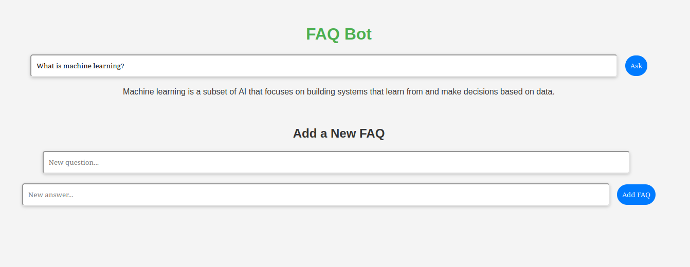

# CodeAlpha_FAQ_Chatbot

An intelligent FAQ chatbot built using `node-nlp` and `express`. This chatbot helps users by answering frequently asked questions and also allows users to submit new FAQs, with the ability to update and dynamically expand the FAQ knowledge base.

## Table of Contents

- [Features](#features)
- [Getting Started](#getting-started)
- [Cloning the Project](#cloning-the-project)
- [Installation Requirements](#installation-requirements)
- [Running the Application](#running-the-application)
- [Project Structure](#project-structure)
- [How to Contribute](#how-to-contribute)
- [License](#license)

## Features

- **FAQ Display**: Shows a list of frequently asked questions for users.
- **Intelligent Responses**: Uses `node-nlp` to answer user queries based on the FAQ data.
- **Dynamic FAQ Updates**: Users can add new FAQs, which are incorporated into the system dynamically without retraining.
- **Interactive UI**: A web-based interface where users can interact with the chatbot.
- **Node.js + Express Backend**: A robust backend that manages interactions between the chatbot, users, and FAQ data.

## Getting Started

Follow these steps to get the project up and running on your local machine.

### Cloning the Project

To clone this repository, use the following command:

```bash
git clone https://github.com/Csasaka19/CodeAlpha_FAQ_Chatbot.git
```
```bash
cd CodeAlpha_FAQ_Chatbot
```


### Installation Requirements

Make sure you have Node.js and npm installed. Then, install the project dependencies:
```bash
npm install

```

```bash
npm index.js
```
The server will be running at :http://localhost:5000



### Project Structure
```bash
CodeAlpha_FAQ_Chatbot/
│
├── models/
│   ├── model.nlp                # FAQ model for storing question-answer pairs that was trained initially
│
├── public/
│   ├── index.html                 # Frontend HTML for interacting with the chatbot
│   ├── css/                       # Frontend styles
│   └── js/                        # Frontend JavaScript
│
├── model.nlp                    # The recent model generated when the user adds a new FAQ
├── index.js                      # Main Express server file
├── package.json                   # Project dependencies and metadata
├── README.md                      # Project documentation
└── .gitignore                     # Ignore unnecessary files

```

### How to Contribute

Contributions are welcome! If you would like to contribute to this project, please follow these steps:

Fork the repository on GitHub.
Create a new branch for your feature or bug fix:

```bash
git checkout -b feature/your-feature-name
```
Make your changes and commit them:
```bash
git commit -m "Add your message here"
```
Push to your branch:

```bash

git push origin feature/your-feature-name
```
Create a pull request to the main repository.


### License

This project is licensed under the GNU Affero General Public License. See the LICENSE file for more information.
  
